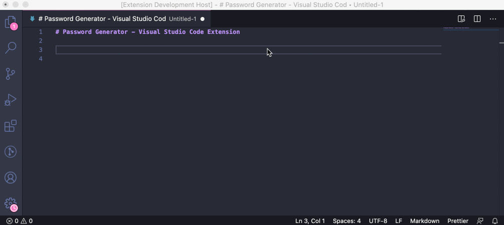

# Password Generator - Visual Studio Code Extension

This extension provide to you options to generate four types of security passwords and allows to copy the generated passwords without having to hit `Control + C`.

## How to use

At any time, you can press `⌘ + ⇧ + P` on Mac or `Control + ⇧ + P` on Windows / Linux and start typing `Password Generator`. The options should appear as fast as expected.

After selecting the one you feel most comfortable with, click the copy button and use your security password generated.

## Questions, Feedback, Contributing

Have a question or feedback?

You can use this repository to:
- Search for [existing issues](https://github.com/ftonato/vscode-password-generator/issues) already reported for potential workarounds.
- [Report a problem](https://github.com/ftonato/vscode-password-generator/issues/new) if you don't find what you are looking for.

See our [CONTRIBUTING](https://github.com/ftonato/vscode-password-generator/blob/main/CONTRIBUTING.md) guide for more details.
